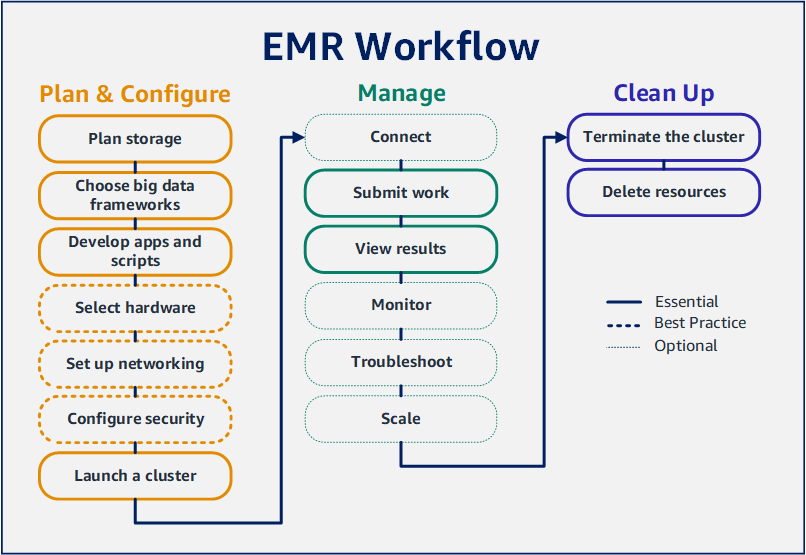

&nbsp;

Okay! Here we are at Lab 7. We have a bookkeeping item to account for (pun 100% intended): <a class="inline_disabled" href="https://aws.amazon.com/getting-started/hands-on/control-your-costs-free-tier-budgets/" target="_blank" rel="noopener">MAKE</a> AN <a class="inline_disabled" href="https://www.lucidity.cloud/blog/aws-budgets" target="_blank" rel="noopener">AWS BUDGET</a> IMMEDIATELY. (0 points, but possibly saves you $4k. YMMV) I named mine <code>broke_college_student</code>, but you can name yours anything you want. As someone who has experienced the nightmare of waking up to orders of magnitude more AWS charges on my credit card than I expected, <em>this is worth every minute you spend on it</em>. Make good decisions. Trust yourself. I'm here for questions/doubts if you have any. And no, I don't have an exact estimate for precisely how much you "should" be "expected" to "pay" for these labs. You're a grown-up. The Free Tier is in fact free and this lab "might" be "able" to squeeze into the Free Tier.

Also, understanding AWS pricing is&nbsp;<em>essential</em> to success if you are the sole "AWS person" at your organization. Whether you work for a non-profit, a startup, a multi-national corporation, or a federal agency, NONE of those bring flowers and sunshine in return to people who bring surprise burdens of thousands of dollars.&nbsp;

WHAT IS HADOOP?

<a class="inline_disabled" href="https://en.wikipedia.org/wiki/Apache_Hadoop" target="_blank" rel="noopener">Hadoop</a> is an Apache Software product, and one of the many <a class="inline_disabled" href="https://medium.com/@singhal.ankur8/the-top-distributed-data-processing-technologies-a-comprehensive-overview-712756db3242" target="_blank" rel="noopener">distributed systems frameworks</a> that allows for using many computers to to do one task (remember <a class="inline_disabled" href="https://www.digitalocean.com/resources/articles/horizontal-scaling-vs-vertical-scaling" target="_blank" rel="noopener">horizontal vs vertical</a> scaling?)

WHAT IS A HADOOP CLUSTER?

Almost any time you hear the word "cluster" it's just another way of saying "a bunch of servers networked together to do a thing". So a "Spark Cluster" and a "Hadoop Cluster" and a "Database Cluster" are all the same thing, just each has a different purpose or intended layer in some stack.

WHAT IS EMR?

EMR is an Amazon Service and stands for <a class="inline_disabled" href="https://aws.amazon.com/emr/" target="_blank" rel="noopener">Elastic MapReduce</a>. MapReduce is the flagship algorithm from Hadoop that became so popular Amazon made a service especially for people to leverage it to make money off people leveraging it all the way back <a class="inline_disabled" href="https://en.wikipedia.org/wiki/Timeline_of_Amazon_Web_Services" target="_blank" rel="noopener">in 2009</a>. The basic idea is "people keep having to set this up manually. Let's let them pay us to do it for them." But I guess that describes&nbsp;<em>every</em> AWS product. The basic ideas is "setup a bunch of servers" and "install Hadoop on them" and "give them work to do" and "show them where to put it" and "shut down all the servers" and "destroy all the virtual servers now".

HOW TO AVOID IT IF IT'S NOT NECESSARY?

You can pretty much do most stuff on a big enough server. But again, you can only "scale up" so far until you absolutely have to "scale out". Make sure the code works, then if it won't run on your machine, try it on a tiny server, then a beefy server. Then if it still won't work, try it on 4.

HOW DO I TELL IF IT'S NECESSARY?

You will almost certainly never need MapReduce for a personal project, but it's a vastly different thing to say in a job interview "I've done that before" vs "I know what that is". But "scale" is the short answer. The longer answer is always much more fun, but web traffic has the same sort of thing, just urgently time-sensitive. Some people call it the "<a class="inline_disabled" href="https://www.youtube.com/watch?v=uZ8DcbhojOw&amp;t=440s" target="_blank" rel="noopener">OOH NOO graph</a>", the "reddit hug of death", or "getting <a class="inline_disabled" href="https://en.wikipedia.org/wiki/Slashdot_effect" target="_blank" rel="noopener">slashdotted</a>", but it's the same thing across the board: you need more compute is all.

DIGITAL OCEAN!

You should know that the "big three" aren't the only game in town. It's also probably a good idea to "try on" some others and see how they fit. Just google "cheap VPS" one time and you'll never be rid of adverts for such. My first experience on the "back end" came from <a class="inline_disabled" href="https://www.digitalocean.com/" target="_blank" rel="noopener">Digital Ocean</a>. They call servers "droplets" there, but it's basically the same thing as AWS in some regards, and yet&nbsp;<em>wildly different</em> in so many, many ways.&nbsp;

GITHUB/GROUP INTERACTION

I've basically handed you everything else on a silver platter in terms of instructions. So I've made a github repo that I'd like everyone to interact with as part of the deliverables. Post, comment, emoji, upvote or whatever. It's very much a case of "YMMV" and "to each their own" when it comes to walkthroughs and guides.&nbsp;

<strong>DELIVERABLES</strong>

<ul>
    <li>Set up a Hadoop cluster of no less than 3 machines</li>
    <li>Show me what you did and how you did it&nbsp; (Anything from "here's the link I used" to "here's every terminal command I ran" will be fine)</li>
    <li>Show me THAT you did it too (proof that you ran a job, so maybe a screenshot of the job status</li>
</ul>

The deliverables are again&nbsp;<em>intentionally</em> vague this time. First of all, because there's like a million ways to set up a cluster. I am not qualified to tell you the best way. Second of all, the journey is <em>always</em> more fun than the destination. Figuring out all the how/what/where and all is literally better than any walkthrough I could ever give to you to say "do what they did".

BOOSTER PACK(S):

<a class="inline_disabled" href="https://www.digitalocean.com/community/tutorials/how-to-spin-up-a-hadoop-cluster-with-digitalocean-droplets" target="_blank" rel="noopener">Here</a> <a class="inline_disabled" href="https://docs.aws.amazon.com/emr/latest/ManagementGuide/emr-gs.html" target="_blank" rel="noopener">are</a> <a class="inline_disabled" href="https://www.reddit.com/r/bigdata/comments/j9lwmj/which_way_of_installing_hadoop_is_efficient_and/" target="_blank" rel="noopener">some</a> <a class="inline_disabled" href="https://hadoop.apache.org/docs/r1.2.1/cluster_setup.html" target="_blank" rel="noopener">suggested</a> <a class="inline_disabled" href="https://www.reddit.com/r/dataengineering/comments/s9q2d2/creating_a_diy_hadoop_cluster_with_several_laptops/" target="_blank" rel="noopener">Hadoop</a> <a class="inline_disabled" href="https://stackoverflow.com/questions/46505552/installing-and-configuring-a-multi-node-hadoop-cluster" target="_blank" rel="noopener">tutorials</a>.

PS: LANGUAGE

At least one company I conduct job interviews for gives special instructions for interviewers to document if the candidate uses <a class="inline_disabled" href="https://www.exygy.com/blog/racist-language-in-software" target="_blank" rel="noopener">terminology rooted in racism</a>. I know the "<a class="inline_disabled" href="https://www.researchgate.net/figure/The-Hadoop-Master-Slave-Architecture-232-MapReduce-MapReduce-is-a-Hadoop-computational_fig1_274069405" target="_blank" rel="noopener">slave/master</a>" language is kind of baked into MapReduce by this point, but you should be aware of the <a class="inline_disabled" href="https://inclusivenaming.org/" target="_blank" rel="noopener">efforts</a> and <a class="inline_disabled" href="https://www.nytimes.com/2021/04/13/technology/racist-computer-engineering-terms-ietf.html" target="_blank" rel="noopener">discussion</a> around removing those terms.

&nbsp;

